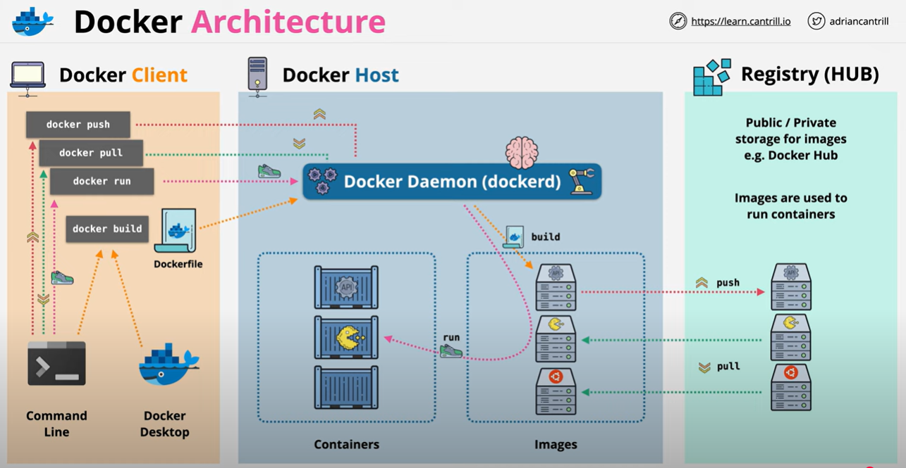

# Docker Setup for MERN Project on Windows

This documentation provides step-by-step instructions to set up Docker for a MERN (MongoDB, Express.js, React, Node.js) project on Windows. It also highlights the benefits of using Docker for deployment, how contributors can collaborate via GitHub, and how to pull images from Docker Hub.

---

## **Table of Contents**
- [Prerequisites](#prerequisites)
- [Installing Docker on Windows](#installing-docker-on-windows)
- [Setting Up Docker for MERN](#setting-up-docker-for-mern)
  - [Creating Dockerfiles](#creating-dockerfiles)
  - [Setting Up Docker Compose](#setting-up-docker-compose)
- [Benefits for Deployment](#benefits-for-deployment)
- [Contributing Using GitHub](#contributing-using-github)
- [Pulling Images from Docker Hub](#pulling-images-from-docker-hub)
- [Additional Docker Commands](#additional-docker-commands)
- [References](#references)

---

## **Prerequisites**
1. Basic understanding of Docker and MERN stack.
2. Git installed on your system.

---

## **Installing Docker on Windows**
1. **Download Docker Desktop:**  
   [Download Here](https://www.docker.com/products/docker-desktop/)

2. **Install Docker Desktop:**  
   - Run the installer and follow the on-screen instructions.
   - Restart your system if prompted.

3. **Start Docker Desktop:**  
   Launch Docker Desktop and ensure it is running. Verify installation:
   ```bash
   docker --version
   ```

---

## **Docker Architecture**


---

## **Setting Up Docker for MERN**

### **Creating Dockerfiles**
Dockerfiles define how each service (backend, frontend) is built.

#### **Backend Dockerfile**
Place this in the `backend` directory:
```dockerfile
FROM node:18-alpine
WORKDIR /app
COPY package*.json ./
RUN npm install
COPY . .
EXPOSE 5000
CMD ["npm", "start"]
```

#### **Frontend Dockerfile**
Place this in the `frontend` directory:
```dockerfile
FROM node:18-alpine
WORKDIR /app
COPY package*.json ./
RUN npm install
COPY . .
RUN npm run build
RUN npm install -g serve
EXPOSE 3000
CMD ["serve", "-s", "build"]
```

---

### **Setting Up Docker Compose**
A `docker-compose.yml` file orchestrates all services.

Create this file in the project root:
```yaml
version: '3.8'

services:
  backend:
    build: ./backend
    ports:
      - "5000:5000"
    volumes:
      - ./backend:/app
    environment:
      - NODE_ENV=development

  frontend:
    build: ./frontend
    ports:
      - "3000:3000"
    volumes:
      - ./frontend:/app

  mongodb:
    image: mongo
    container_name: mern-mongo
    ports:
      - "27017:27017"
    volumes:
      - mongo-data:/data/db

volumes:
  mongo-data:
```

---


## **Benefits for Deployment**
1. **Environment Consistency:**  
   Docker ensures the application behaves identically across all environments.

2. **Simplified Deployment:**  
   Containerize the MERN stack and deploy it as a single unit.

3. **Efficient Scaling:**  
   Scale individual services (frontend, backend, database) independently.

4. **Portability:**  
   Docker containers can run on any system with Docker installed.

---

## **Contributing Using GitHub**

### **Step 1: Fork the Repository**
- Navigate to the project repository on GitHub and click **Fork** to create a copy.

### **Step 2: Clone the Repository**
- Clone your fork to your local machine:
  ```bash
  git clone <forked-repo-url>
  cd <project-folder>
  ```

### **Step 3: Build and Run Docker Containers**
- Build and run the project with Docker Compose:
  ```bash
  docker-compose up --build
  ```

### **Step 4: Make Changes**
- Edit the code. Changes in your local files will reflect in the running containers.

### **Step 5: Commit and Push Changes**
- Commit your updates and push them to your fork:
  ```bash
  git add .
  git commit -m "Describe your changes"
  git push origin main
  ```

### **Step 6: Create a Pull Request**
- Go to the original repository on GitHub and create a Pull Request to propose your changes.

---

## **Pulling Images from Docker Hub**

1. **Search for an Image:**  
   Visit [Docker Hub](https://hub.docker.com/) and find the desired image.

2. **Pull the Image:**  
   Use the `docker pull` command:
   ```bash
   docker pull <image-name>
   ```
   Example for MongoDB:
   ```bash
   docker pull mongo
   ```

3. **Run the Container:**  
   Start the container using the pulled image:
   ```bash
   docker run -d -p 27017:27017 mongo
   ```

---

## **Additional Docker Commands**

- **List running containers:**
  ```bash
  docker ps
  ```
- **Stop a container:**
  ```bash
  docker stop <container-id>
  ```
- **Remove a container:**
  ```bash
  docker rm <container-id>
  ```
- **Remove an image:**
  ```bash
  docker rmi <image-id>
  ```

---

## **References**
- **Docker Desktop:** [https://www.docker.com/products/docker-desktop/](https://www.docker.com/products/docker-desktop/)  
- **Docker Hub:** [https://hub.docker.com/](https://hub.docker.com/)  
- **Video Guide:** [Docker for Beginners](https://youtu.be/31k6AtW-b3Y?si=UvCgBhcvA0_A35z8)
